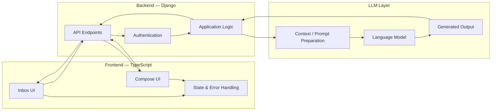

# Zulip-LLM-Features

**Role:** Full-Stack Engineer — Machine Learning in Production Course Project  

**When:** Sep. 2026 · **Location:** Pittsburgh, PA  

> **Project Context:** Developed as part of Carnegie Mellon University's
> Machine Learning in Production course using the existing Zulip codebase.
> This portfolio highlights my implementation, architecture, and engineering contributions.


---

## Projects at a Glance

| Feature | Problem | What I Built | Result | Stack |
|---|---|---|---|---|
| **F1. Unread Message Recap** | Users with many unread Zulip messages must manually scan conversations to understand what they missed | LLM-powered unread-message summarization workflow integrated into the Zulip Inbox | Users can generate concise recaps and navigate back to relevant source messages | **Python**, **Django**, **TypeScript**, **REST APIs**, **LLM Integration**, **Zulip** |
| **F2. Topic Title Suggestion** | Users may need to manually create concise and descriptive topic titles while composing messages | LLM-assisted topic-title generation integrated into the message compose workflow | Users can generate suggested topic titles directly within the existing Zulip interface | **Python**, **Django**, **TypeScript**, **REST APIs**, **LLM Integration**, **Zulip** |
| **F3. Full-Stack Integration & Testing** | New AI functionality must behave reliably within an established production-scale codebase | Authenticated backend APIs, frontend state handling, error handling, and automated backend/frontend tests | Integrated LLM functionality while preserving existing application behavior and user workflows | **Django**, **TypeScript**, **Automated Testing**, **API Design**, **Git** |


---

## Project Details

### F1 — Unread Message Recap

**Problem:**  
Zulip users can accumulate a large number of unread messages across conversations.
Understanding what was missed requires opening and reading messages individually.

**Solution:**  
Built an **LLM-powered unread-message recap feature** that retrieves unread messages,
sends the relevant content through a backend summarization workflow, and presents
the generated recap inside the Zulip Inbox interface.

**Software/ML-oriented highlights:**
- **Unread-message retrieval:** Integrated with Zulip's existing unread-message workflow to identify messages matching unread state.
- **Backend API:** Developed authenticated **Django endpoints** responsible for retrieving relevant messages, preparing model input, invoking the LLM workflow, and returning structured responses.
- **LLM integration:** Converted conversation content into prompts suitable for summarization while keeping the feature integrated with existing Zulip application logic.
- **Frontend integration:** Built **TypeScript UI interactions** inside the Inbox so users can request and view recaps without leaving the application.
- **Source navigation:** Included links from generated recap content back to the corresponding source messages so users can inspect the original conversation context.
- **UI state management:** Handled **loading, success, empty, and error states** so the feature behaves predictably across different user situations.
- **Testing:** Added backend and frontend test coverage to validate API behavior and interface logic.

**Impact:**
- Added an end-to-end AI-assisted workflow for understanding unread conversations.
- Reduced the need to manually scan every unread message before identifying relevant discussions.
- Demonstrated integration of an LLM feature across backend APIs, frontend interfaces, and an existing production-scale application architecture.

```mermaid
flowchart LR
    U["User opens Zulip Inbox"]
    U --> R["Request unread recap"]

    R --> FE["TypeScript frontend"]
    FE --> API["Authenticated Django API"]

    API --> UM["Retrieve unread messages"]
    UM --> PP["Prepare message context"]

    PP --> LLM["LLM summarization"]
    LLM --> RES["Structured recap response"]

    RES --> FE
    FE --> UI["Display recap in Inbox"]

    UI --> SRC["Source-message links"]
    SRC --> MSG["Original Zulip messages"]

    FE --> STATE["UI state handling"]
    STATE --> LOAD["Loading"]
    STATE --> EMPTY["Empty"]
    STATE --> ERR["Error"]

---

### F2 — Topic Title Suggestion

**Problem:**  
When composing Zulip messages, users must manually create topic titles that clearly represent the conversation. Poor or vague titles can make discussions harder to organize and navigate.

**Solution:**  
Built an **LLM-assisted topic-title suggestion feature** integrated directly into Zulip's message composition workflow.

**Software/ML-oriented highlights:**
- **Compose integration:** Added topic-title suggestion functionality to the existing Zulip message-composition interface.
- **Backend API:** Developed a Django endpoint that accepts message context, prepares the LLM request, and returns a generated topic-title suggestion.
- **LLM generation:** Used message content as contextual input to generate concise and relevant topic titles.
- **Frontend workflow:** Integrated the returned suggestion into the **TypeScript compose interface** so users can request and apply a suggested title without leaving the compose workflow.
- **Request validation:** Handled authentication, input validation, and structured responses between the frontend and backend.
- **Failure handling:** Designed the feature so API or model failures do not interrupt the normal message-composition workflow.
- **Testing:** Added backend and frontend automated tests covering the title-suggestion workflow.

**Impact:**
- Added AI-assisted topic organization directly into an existing communication workflow.
- Reduced friction between composing a message and selecting an appropriate discussion topic.
- Demonstrated how generative AI can augment an existing product workflow while keeping the user in control of the final output.

```mermaid
flowchart LR
    U["User composes message"]
    U --> C["Message content"]

    C --> BTN["Request title suggestion"]
    BTN --> FE["TypeScript frontend"]

    FE --> API["Authenticated Django API"]
    API --> CTX["Prepare message context"]

    CTX --> LLM["LLM title generation"]
    LLM --> TITLE["Suggested topic title"]

    TITLE --> API
    API --> FE

    FE --> DISPLAY["Display suggestion"]
    DISPLAY --> USER{"User decision"}

    USER -->|Accept| APPLY["Apply suggested title"]
    USER -->|Edit or Ignore| MANUAL["Continue manual editing"]
```

---

### F3 — Full-Stack LLM Integration & Testing

**Problem:**  
Adding LLM functionality to a mature application involves more than invoking a model. The feature must work reliably across existing backend APIs, authentication, frontend state, error handling, and testing infrastructure without disrupting established application behavior.

**Solution:**  
Integrated both AI-powered features across the **Django backend and TypeScript frontend**, while following the architecture and conventions of the existing Zulip codebase.

**Engineering highlights:**
- **Existing-codebase development:** Worked within Zulip's large full-stack application rather than building an isolated prototype.
- **API integration:** Connected TypeScript client interactions with authenticated Django backend endpoints using structured requests and responses.
- **Separation of concerns:** Kept model invocation, backend application logic, and frontend presentation responsibilities separated.
- **State management:** Explicitly handled **loading, success, empty, and error states** for asynchronous LLM requests.
- **Graceful degradation:** Ensured LLM failures did not prevent users from continuing normal Zulip workflows.
- **Automated testing:** Added backend and frontend tests to validate feature behavior and reduce the risk of regressions.
- **Incremental development:** Developed and validated changes within an existing Git-based software engineering workflow.

**Impact:**
- Delivered two end-to-end LLM capabilities inside an established full-stack communication platform.
- Gained experience integrating AI functionality into an existing software system rather than developing a standalone ML prototype.
- Strengthened practical experience across **backend engineering, frontend development, API design, testing, and LLM application development**.



---

## Tech Stack

| Area | Technologies |
|---|---|
| **Backend** | Python, Django |
| **Frontend** | TypeScript, Zulip Web UI |
| **AI / ML** | Large Language Models, Prompt-Based Summarization, Text Generation |
| **APIs** | Authenticated REST APIs |
| **Testing** | Backend and Frontend Automated Tests |
| **Engineering** | Git, Existing-Codebase Integration, Full-Stack Development |

---

## Key Engineering Takeaways

This project strengthened my ability to work at the intersection of **software engineering and machine learning engineering**.

Rather than building an isolated LLM prototype, I integrated model-backed functionality into an established full-stack application. This required understanding an unfamiliar codebase, designing backend interfaces, implementing frontend workflows, handling asynchronous application states, validating behavior through automated testing, and considering how AI-generated outputs should fit naturally into an existing user experience.

The project reinforced an important principle of machine learning in production:

> **A useful AI feature is not only a model call—it is a complete software system around the model.**

---

## Repository Context

This project was completed as part of Carnegie Mellon University's **Machine Learning in Production** course.

The implementation focuses on extending the existing Zulip application with full-stack LLM functionality while preserving the application's established architecture and workflows.
